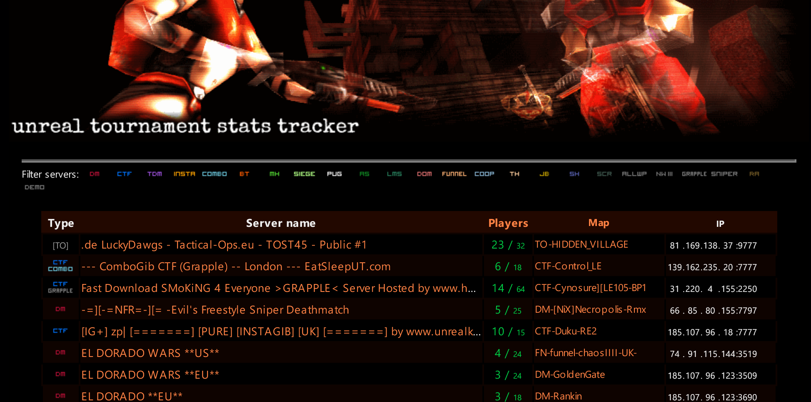
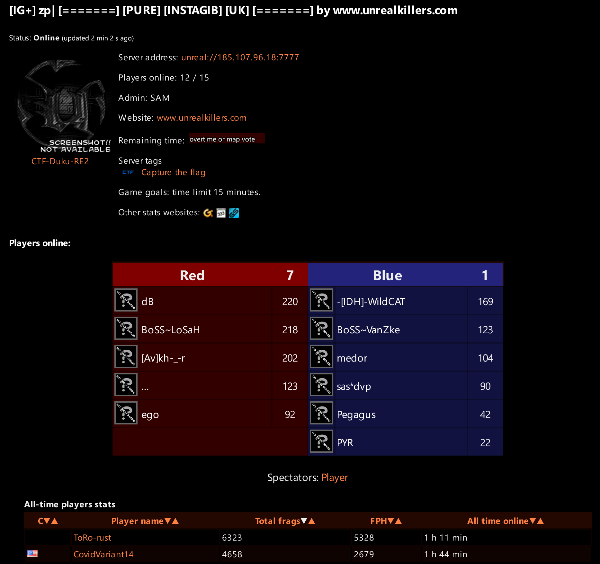

# Unreal Tournament Stats Tracker
## About
Unreal Tournament Stats Tracker allows you to view various statistics 
about players and servers. It also provides Point-Of-Interests maps - 
automatically generated from countless levels created by UT community
during last 20+ years.  

## Current development - UTT2
The project is being rewritten to utilize modern technologies. Aims to be more
stable, and deployable in various environments. 

One of the goals is staying faithful to the minimalism of legacy version.
No kilometer-scrolling fashion of "modern" web dev.

New version is split into different microservices:

- [uttracker-web](https://github.com/naomai/uttracker-web) - website (PHP, Laravel, Vue)
- [uttracker-indexer](https://github.com/naomai/uttracker-indexer) - server data collector, formerly `ServerScanner` (VB.NET, C#)
- [uttracker-poi](https://github.com/naomai/uttracker-downloader) - POI maps generator and level downloader (Python, PHP) 

The original version was an excercise on data collection and analysis I made between 2014-2016. The site used to be running at the address http://tracker.ut99.tk [[archive]](https://web.archive.org/web/20141022105035/http://tracker.ut99.tk/)

